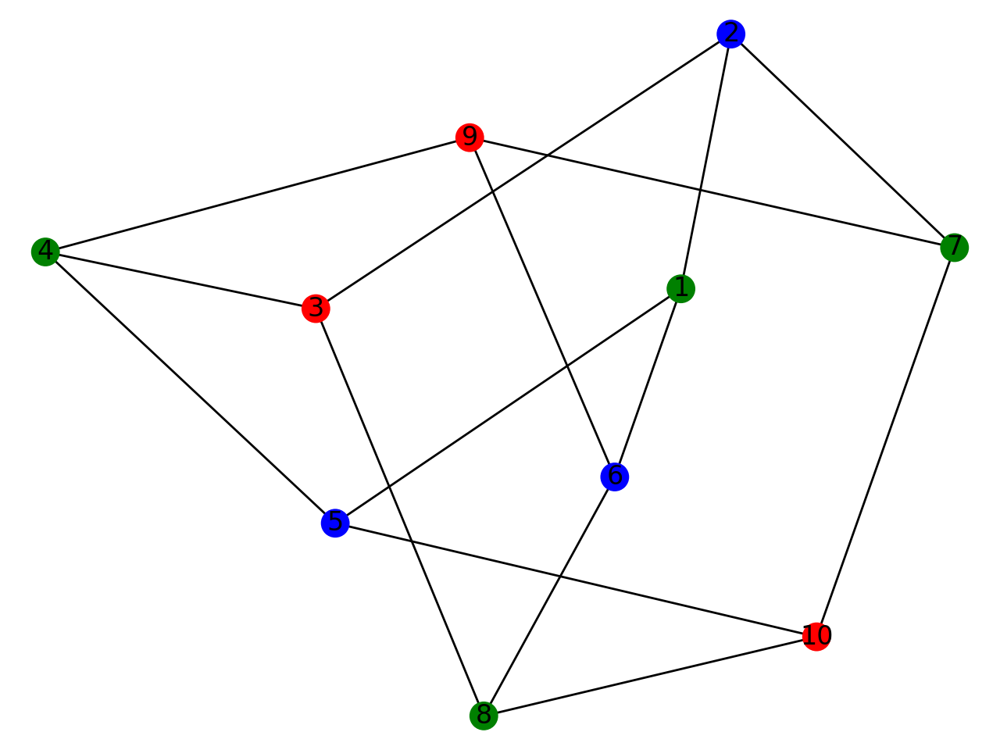

# Colorization SAT problem
## requirements :
`python 3`
`sudo pip3 install pandas`
`sudo pip3 install networkx`
`sudo pip3 install matplotlib`    

## how to use it :
`python3 main.py -h`
```-h : help()
-g graphFileName : Load a graph with the filename
-c nbColors : Genere DISMACS file to colorize the graph with nbColors
-o outputFileName : Save the DISMACS file created
-r nameOS : Run Gophersat using the outputFile nameOS in [linux, windows, macOS]
-i : Display text of an interpretation
-d : Display image of an interpretation
```

## examples :
`python3 main.py -g cubic_graph.txt -c 3 -o cb.cnf -r macOS -i -d`

Output File : 
```
c
c  cubic_graph.txt
c
p cnf 30 85
1 2 3 0
-1 -2 0
-1 -3 0
-2 -3 0
[...]
28 29 30 0
-28 -29 0
-28 -30 0
-29 -30 0
```

Gophersat run :
```
c solving cb.cnf
s SATISFIABLE
v -1 2 -3 -4 -5 6 7 -8 -9 -10 11 -12 -13 -14 15 -16 -17 18 -19 20 -21 -22 23 -24 25 -26 -27 28 -29 -30 0
```

Text Interpretation :
```
Vertice 1  :   Green
Vertice 2  :   Blue
Vertice 3  :   Red
Vertice 4  :   Green
Vertice 5  :   Blue
Vertice 6  :   Blue
Vertice 7  :   Green
Vertice 8  :   Green
Vertice 9  :   Red
Vertice 10  :   Red
```

Image Interpretation :
